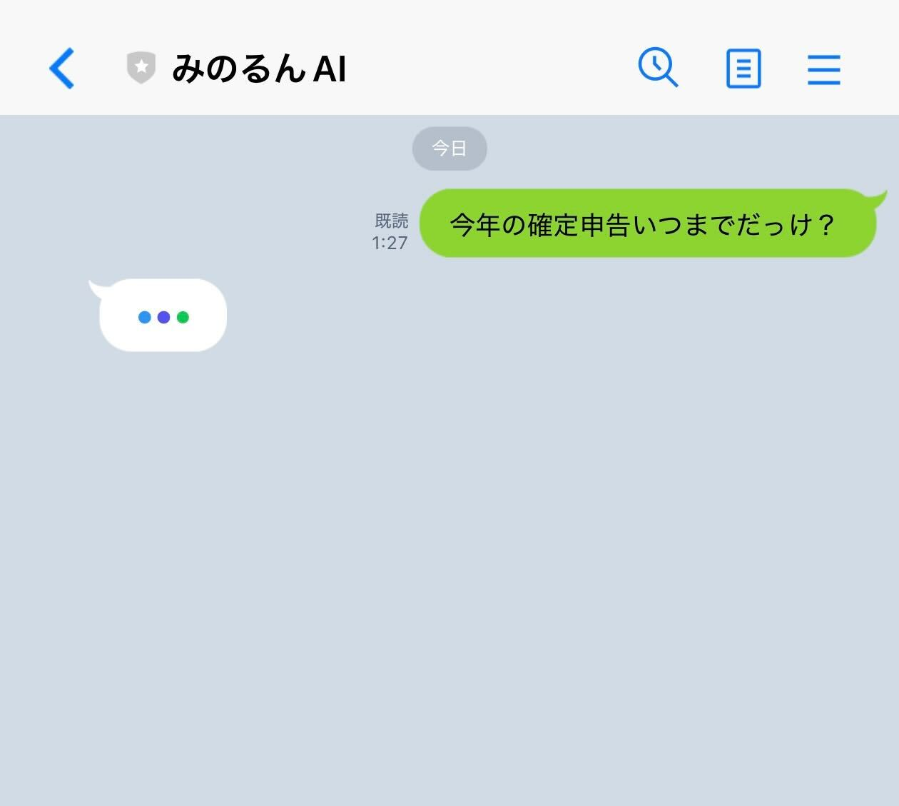
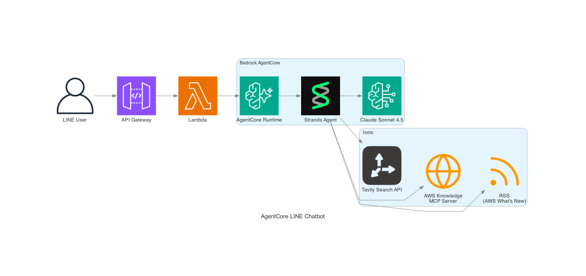

# AgentCore LINE Chatbot

LINE で動く AI チャットボットを、AWS Bedrock AgentCore + Strands Agents でサーバーレスに構築するサンプルです。

## 概要

LINE にメッセージを送ると、AI エージェントがウェブ検索や AWS ドキュメント検索などのツールを駆使して回答してくれます。
ツール実行中の途中経過もリアルタイムに吹き出し表示されるので、待ち時間のストレスがありません。

 

## システム構成



| レイヤー | 技術 |
|---------|------|
| IaC | AWS CDK (TypeScript) + AgentCore L2 コンストラクト |
| Webhook | API Gateway (REST) + Lambda (Python 3.13 / ARM64) |
| Agent | Strands Agents on Bedrock AgentCore Runtime |
| LLM | Claude Sonnet 4.5 on Amazon Bedrock |

## 機能

- Tavily API を使ったウェブ検索（ニュース、技術情報、一般知識など）
- AWS Knowledge MCP Server によるAWSドキュメント検索・閲覧
- AWS What's New の RSS フィード取得
- SSE ストリーミングによるリアルタイム応答（ツール実行状況を LINE に逐次表示）
- 1対1チャット / グループチャット（メンション起動）の両対応
- 会話履歴の保持（セッション管理、15分 TTL）
- OpenTelemetry による可観測性

### エージェントのツール一覧

| ツール | 説明 |
|-------|------|
| `web_search` | Tavily API によるウェブ検索 |
| `current_time` | 現在の UTC 時刻を取得 |
| `rss` | RSS フィード取得（AWS What's New など） |
| `search_documentation` | AWS 公式ドキュメント検索（MCP Server 経由） |
| `read_documentation` | AWS ドキュメントのページ読み取り（MCP Server 経由） |

## デプロイ手順

### 前提条件

- AWS CLI（SSO 設定済み）、Node.js 18+、Docker
- LINE Developers の Messaging API チャネル
- [Tavily](https://tavily.com) の API キー

### 1. クローン & インストール

```bash
git clone https://github.com/minorun365/agentcore-line-chatbot.git
cd agentcore-line-chatbot
npm install
```

### 2. 環境変数の設定

```bash
cp .env.example .env.local
```

`.env.local` に以下の値を記入します。

| 変数名 | 説明 | 取得元 |
|--------|------|--------|
| `LINE_CHANNEL_SECRET` | LINE チャネルシークレット | LINE Developers コンソール |
| `LINE_CHANNEL_ACCESS_TOKEN` | LINE アクセストークン | LINE Developers コンソール |
| `TAVILY_API_KEY` | Tavily API キー | Tavily ダッシュボード |

### 3. AWS へデプロイ

```bash
aws sso login --profile your-profile
set -a && source .env.local && set +a
npx cdk deploy --profile your-profile
```

### 4. LINE Webhook の設定

デプロイ完了時に出力される **WebhookUrl** を LINE Developers コンソールに設定します。

- 「Webhook の利用」→ オン
- 「応答メッセージ」→ オフ
- グループで使う場合は「グループトーク・複数人トークへの参加を許可する」→ オン

### 運用コマンド

```bash
npx cdk deploy --profile your-profile             # フルデプロイ
set -a && source .env.local && set +a
npx cdk deploy --hotswap --profile your-profile    # エージェントのみ高速デプロイ
npx cdk diff --profile your-profile                # 差分確認
```
